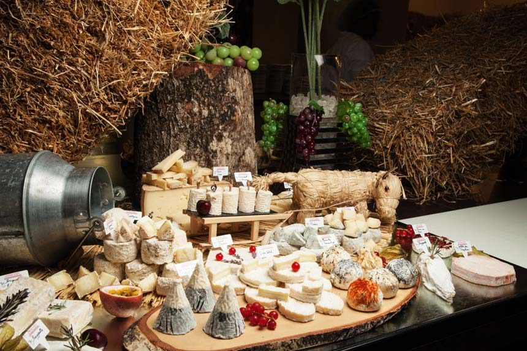

# E-commmerce "LA EUROPEA"

## por Claudio Sabatini

### Realizado como proyecto piloto

este proyecto esta construido con libreria
* react router dom
* sweet alert
* font awesome

pasos para reproducir
1. clona el repo
2. haz un npm i
3. haz un npm start

**Para ver el [deploy](https://62e4305b707898322cfe2357--sparkling-youtiao-b3df00.netlify.app/)**

>Gracias por visitar el proyecto!!

